# Linux-server-permissions-and-management-practical.
Hands-on Linux system administration project focused on user management, file permissions, and secure shared directory configuration.

## Project Overview

In this practical session, I built a real multi-user Linux server environment to understand how system administrators manage users, groups, file ownership and permissions securely.

The goal was to simulate a real DevOps collaboration scenario where multiple users work on the same server while maintaining proper access control and security.

---

## Table of Contents

- [Project Overview](#project-overview)
- [Step 1 — Creating Users](#step-1--creating-users)
- [Step 2 — Creating a Team Group](#step-2--creating-a-team-group)
- [Step 3 — Creating Permission Lab Workspace](#step-3--creating-permission-lab-workspace)
- [Step 4 — Creating Files and Project Directory](#step-4--creating-files-and-project-directory)
- [Step 5 — Practicing Basic Permission Change](#step-5--practicing-basic-permission-change)
- [Step 6 — Recursive Permission and Ownership](#step-6--recursive-permission-and-ownership)
- [Step 7 — Creating Shared Project Folder for Team](#step-7--creating-shared-project-folder-for-team)
- [Step 8 — Setting SGID for Group Inheritance](#step-8--setting-sgid-for-group-inheritance)
- [Step 9 — Multi-User Collaboration Test](#step-9--multi-user-collaboration-test)
- [Step 10 — Creating Global Shared Folder](#step-10--creating-global-shared-folder-sticky-bit-lab)
- [Step 11 — Sticky Bit Protection Test](#step-11--sticky-bit-protection-test)
- [Step 12 — Permission Denied Troubleshooting](#step-12--permission-denied-troubleshooting)
- [Step 13 — Recovering Sudo Privileges](#step-13--recovering-sudo-privileges)
- [Key Commands Practiced](#key-commands-practiced)
- [Real DevOps Scenario](#real-devops-scenario)
- [Lessons Learned](#lessons-learned)
- [Future Improvements](#future-improvements)
- [Challenges Faced During This Project](#challenges-faced-during-this-project)
- [What I Would Do in a Production Environment](#what-i-would-do-in-a-production-environment)
- [Key Concepts Learned](#key-concepts-learned)
- [Project Timeline](#project-timeline)
- [Production Risk Analysis](#production-risk-analysis)
- [Repository Folder Structure](#repository-folder-structure)
- [Learning Roadmap](#learning-roadmap)
- [Conclusion](#conclusion)
- [Author](#author)

## Step 0 — First Remote Connection to Server (SSH Trust Establishment)

Before starting the permission management lab, I connected remotely to the Linux server using SSH through MobaXterm.

During the first connection attempt, the system displayed a security prompt requesting confirmation of the server’s identity (host fingerprint verification).

Accepting this prompt established a trusted encrypted communication channel between my local machine and the remote server.

This step is important in real DevOps workflows because it ensures secure remote infrastructure access.

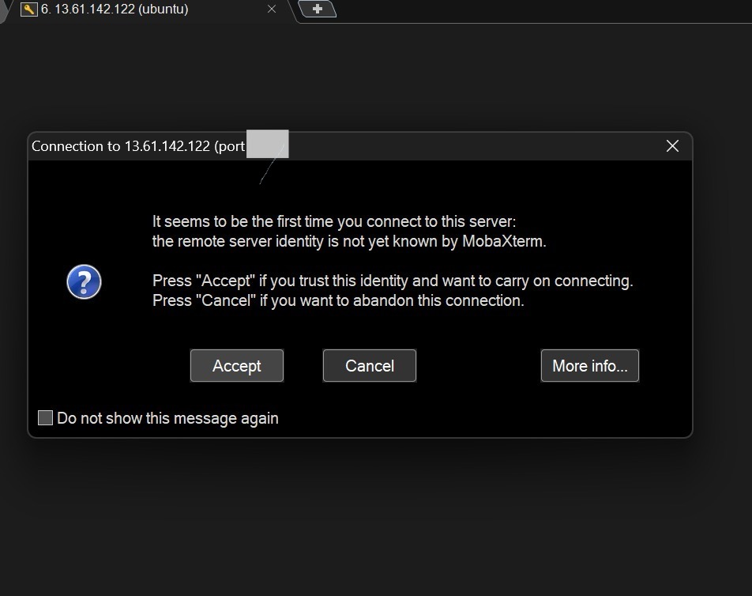

## Step 1 — Creating Users

To simulate team members on the server, I created two users:

- love  
- nicky  

Linux automatically:

- Created home directories  
- Assigned unique User IDs (UID)  
- Created primary groups  
- Copied default configuration files from `/etc/skel`  
- Prompted for password setup  

```bash
sudo adduser nicky ; sudo adduser love
```

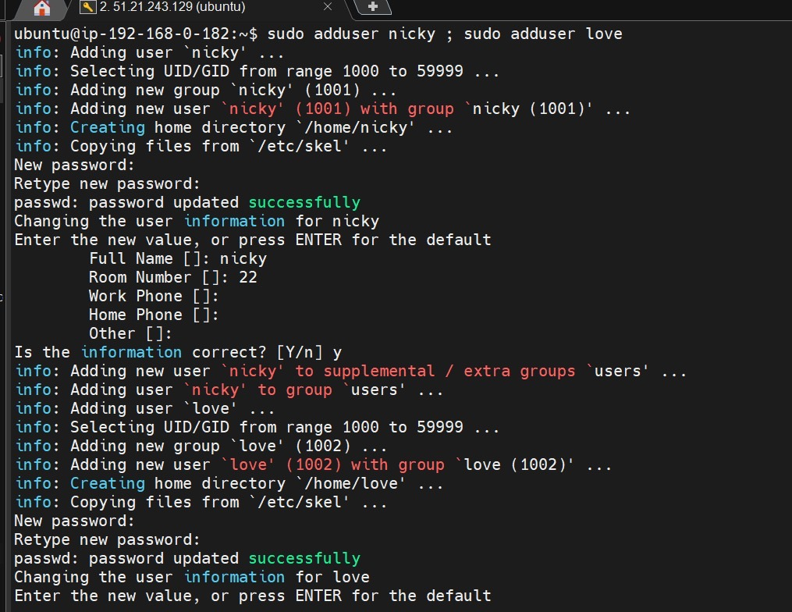

---
### Step 1b — Executing Multiple Commands Efficiently

To improve administrative efficiency, I practiced executing multiple Linux commands in a single line using the command separator ;.

This technique is useful for automation scripts, DevOps workflows, and rapid server configuration.
sudo adduser nicky ; sudo adduser love
sudo groupadd devteam ; sudo usermod -aG devteam nicky ; sudo usermod -aG devteam love

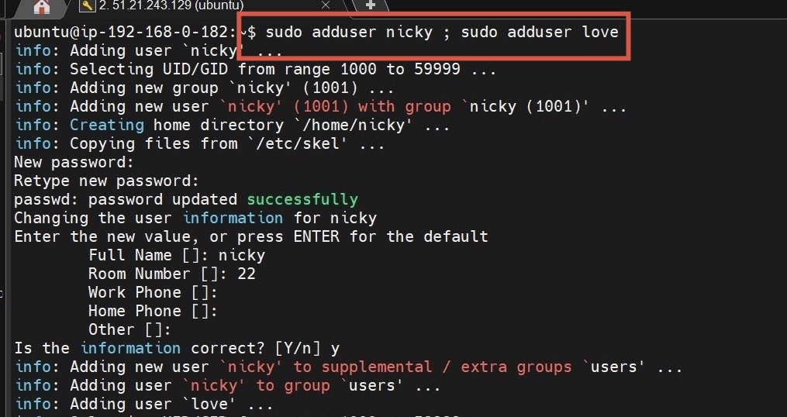

## Step 2 — Creating a Team Group

To allow collaboration between the users, I created a shared group called **devteam** and added both users.

```bash
sudo groupadd devteam
sudo usermod -aG devteam nicky
sudo usermod -aG devteam love
```

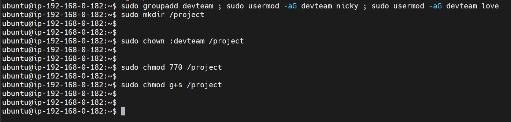

---

## Step 3 — Creating Permission Lab Workspace

I created a working directory to practice permission management.

```bash
mkdir permission-lab
cd permission-lab
```

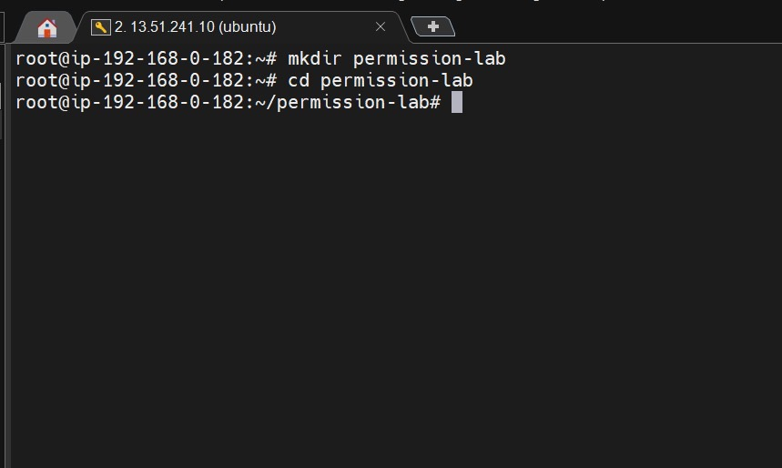

---

## Step 4 — Creating Files and Project Directory

Inside the lab workspace, I created:

- file.txt  
- script.sh  
- project directory  

```bash
touch file.txt script.sh
mkdir project
```

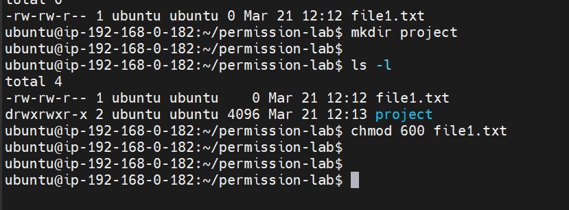

---

## Step 5 — Practicing Basic Permission Change

I experimented with permission control.

```bash
chmod +x script.sh
chmod 600 file.txt
```

This helped me understand execute permission and restricted file access.

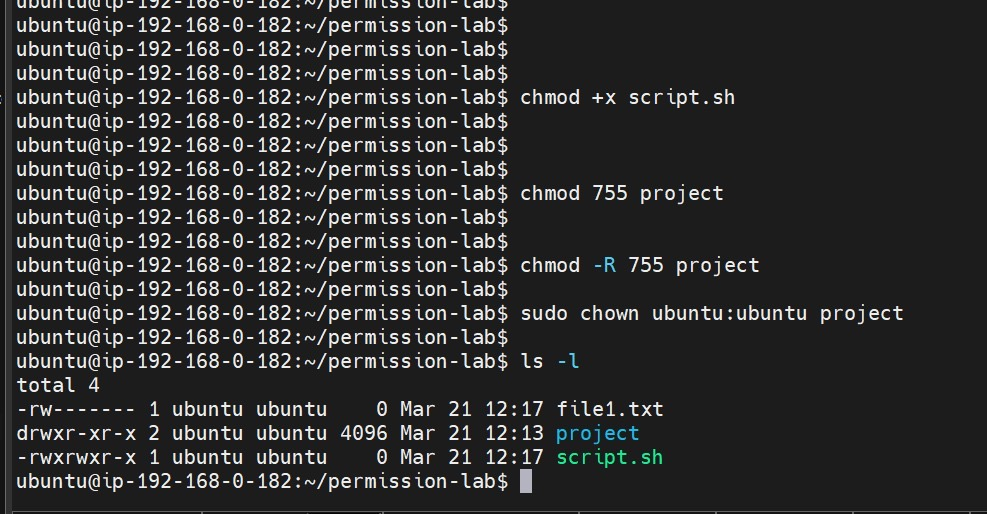

---

## Step 6 — Recursive Permission and Ownership

To simulate real application environments, I applied recursive permissions and changed ownership.

```bash
chmod -R 755 project
sudo chown ubuntu:ubuntu project
```

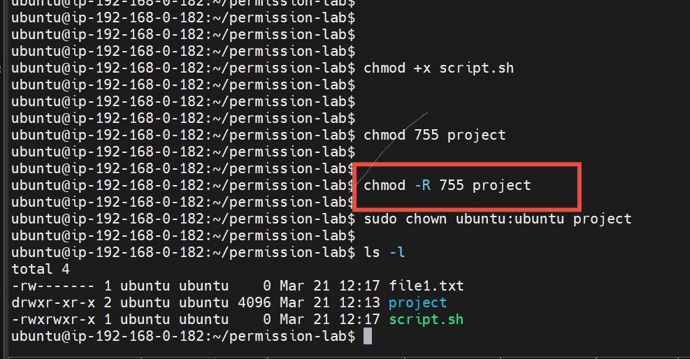

---

## Step 7 — Creating Shared Project Folder for Team

To allow collaboration, I created a shared directory and assigned group ownership.

```bash
sudo mkdir /project-team
sudo chown :devteam /project-team
sudo chmod 770 /project-team
```


---

## Step 8 — Setting SGID for Group Inheritance

To ensure all files created inside the folder inherit the group ownership, I enabled SGID.

```bash
sudo chmod g+s /project-team
```

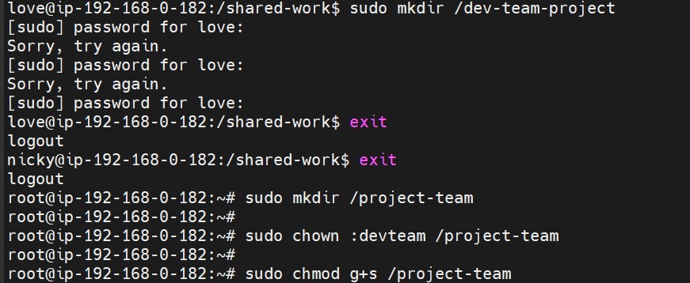

---

## Step 9 — Multi-User Collaboration Test

Both users logged in and created files inside the shared directory.

This confirmed:

- Files inherit devteam group  
- Collaboration works correctly  

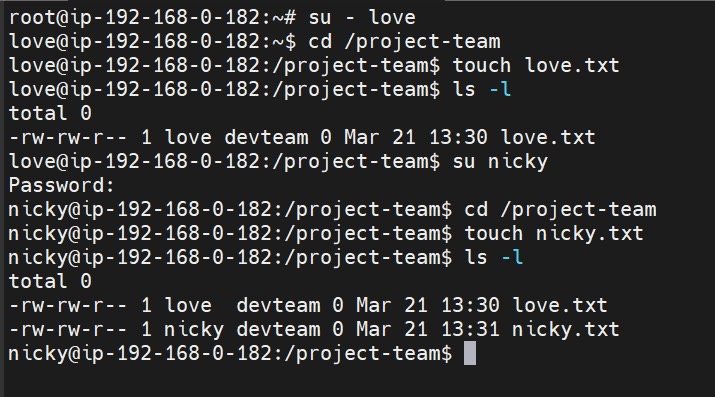

---

## Step 10 — Creating Global Shared Folder (Sticky Bit Lab)

To simulate public shared space like `/tmp`, I created:

```bash
sudo mkdir /shared-work
sudo chmod 777 /shared-work
sudo chmod +t /shared-work
```

Sticky bit ensures users cannot delete files owned by others.

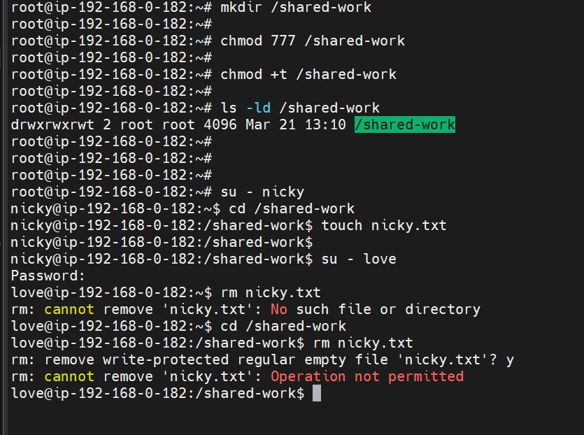

---

## Step 11 — Sticky Bit Protection Test

One user created a file and another user attempted deletion.

Deletion failed, confirming sticky bit security.


---

## Step 12 — Permission Denied Troubleshooting

I encountered permission denied errors when accessing private directories.

This helped me learn:

- Importance of execute permission on parent directories  
- Need for proper group membership  
- Correct permission adjustment strategy  

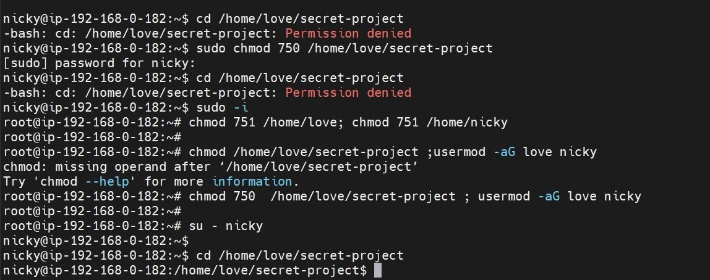

---

## Step 13 — Recovering Sudo Privileges

Some users initially could not run administrative commands.

I fixed this by adding them to the sudo group.

```bash
sudo usermod -aG sudo love
sudo usermod -aG sudo nicky
```

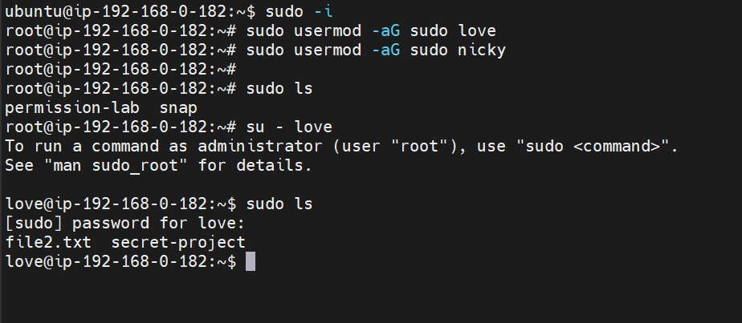

---

## Key Commands Practiced

```bash
adduser
groupadd
usermod
chmod
chown
ls -l
chmod -R
chmod g+s
chmod +t
```

---

## Real DevOps Scenario

This project simulates real situations where:

- Developers share project directories  
- Incorrect permissions can break deployments  
- Sticky bit protects shared temporary folders  
- SGID ensures consistent collaboration  
- Administrators must troubleshoot access issues quickly  

---

## Lessons Learned

- Linux permission hierarchy  
- Multi-user server security design  
- Ownership and group inheritance  
- Sticky bit and SGID importance  
- Troubleshooting real permission issues  
- Efficient command execution  

---

## Future Improvements

- SUID permission practical  
- Access Control List (ACL)  
- Production web server permission design  
- CI/CD permission automation  
- Linux security hardening

  ---

## Challenges Faced During This Project

During this practical lab, I encountered several real Linux administration challenges which helped deepen my understanding of permission management and multi-user collaboration.

### Permission Denied Errors  
While trying to access directories created by another user, I repeatedly encountered permission denied errors.  
This helped me understand the importance of execute permission on parent directories and the relationship between ownership and group access.

### Sticky Bit Behavior  
Initially, I expected users to be able to delete files in globally writable directories.  
After enabling Sticky Bit, deletion attempts failed, which clarified how Linux protects user files in shared environments.

### Sudo Privilege Management  
Some users were unable to execute administrative commands.  
This required switching to an administrative account and correctly assigning sudo privileges.

### Command Syntax and Permission Debugging  
While chaining commands and modifying permissions, I encountered syntax mistakes.  
This improved my troubleshooting approach and command accuracy.

---

## What I Would Do in a Production Environment

In a real production server environment, permission architecture would be designed with stronger security and structure.

- Avoid using `777` permissions and follow the **least privilege principle**
- Implement role-based group structures (developers, testers, administrators)
- Use Access Control Lists (ACL) for granular permission assignment
- Automate permission setup using Bash scripts or configuration management tools such as Ansible
- Enable logging and monitoring for sensitive directories
- Regularly audit user access and privilege assignments

---

## Key Concepts Learned

This project helped reinforce critical Linux administration concepts:

- Difference between file ownership and group ownership  
- Permission hierarchy for users, groups, and others  
- Importance of execute permission on directories  
- Risks associated with overly permissive access such as `777`  
- Role of SGID in collaborative project folders  
- How Sticky Bit protects files in shared directories  
- Troubleshooting permission denied errors  
- Managing administrative privileges using sudo  

---

## Project Timeline

This project was completed through the following stages:

1. Server deployment and remote SSH access  
2. User creation and group configuration  
3. File and directory permission practice  
4. Recursive permission and ownership management  
5. Collaborative folder setup with SGID  
6. Shared public directory protection using Sticky Bit  
7. Permission denied troubleshooting and privilege correction  
8. Verification of multi-user collaboration  

---

## Production Risk Analysis

Incorrect permission configuration in real environments can lead to:

- Unauthorized file modification or deletion  
- Application deployment failures  
- Security vulnerabilities due to excessive access  
- Collaboration conflicts among development teams  

Proper permission design helps maintain **system stability, security, and operational efficiency.**

---

## Repository Folder Structure

```
linux-permission-lab/
│
├── README.md
│
├── images/
│   ├── user-creation.jpg
│   ├── group-creation.jpg
│   ├── permission-lab-created.jpg
│   ├── files-created.jpg
│   ├── basic-permission-change.jpg
│   ├── recursive-permission.jpg
│   ├── shared-project-created.jpg
│   ├── sgid-enabled.jpg
│   ├── collaboration-test.jpg
│   ├── sticky-bit-folder.jpg
│   ├── sticky-bit-test.jpg
│   ├── permission-denied.jpg
│   └── sudo-privilege-fix.jpg
│
└── scripts/
    └── permission-automation.sh
```

---

## Learning Roadmap

To build on this project, I plan to continue developing practical skills in:

- Advanced Linux permissions (SUID and ACL)
- Web server permission architecture and deployment
- CI/CD pipeline implementation and automation
- Linux security hardening and user auditing
- Infrastructure automation using configuration management tools

## Conclusion

This project provided practical experience in designing and managing Linux permission structures within a multi-user server environment.

Through real troubleshooting scenarios and collaborative folder configuration, I developed a stronger understanding of access control strategies, security best practices, and administrative workflows required in modern DevOps environments.

The knowledge gained from this lab forms a solid foundation for managing production infrastructure and implementing automated deployment pipelines securely.

## Author
Love Daniels
Email:lovedaniels2239@gmail.com

This project was completed as part of my hands-on learning journey in Linux system administration and DevOps engineering.

I am continuously building practical projects to strengthen my skills in:

- Linux administration  
- Cloud infrastructure  
- Automation and CI/CD  
- Infrastructure security  

More projects will be added as I progress in my DevOps learning path.

